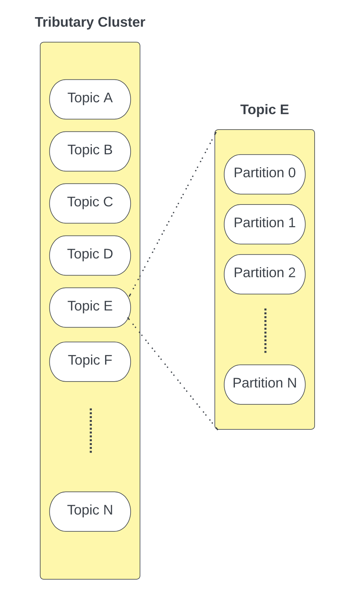
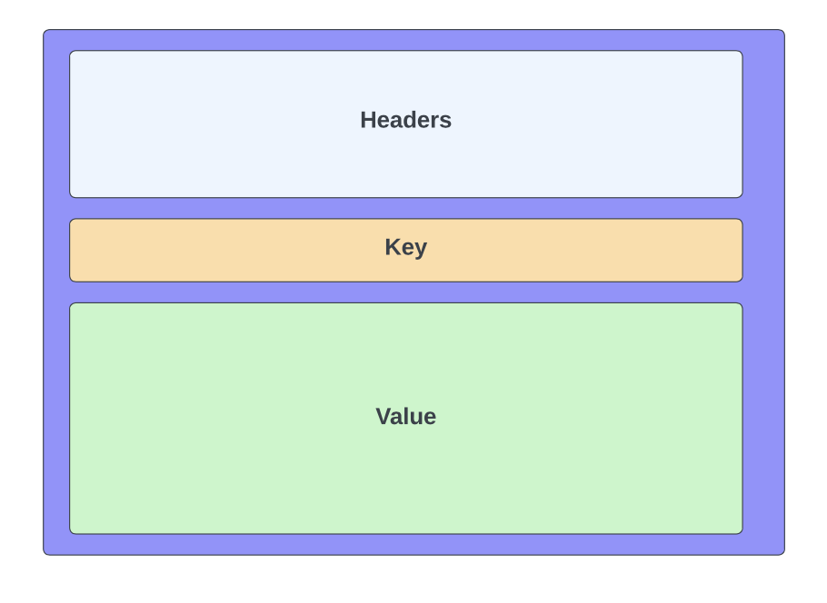
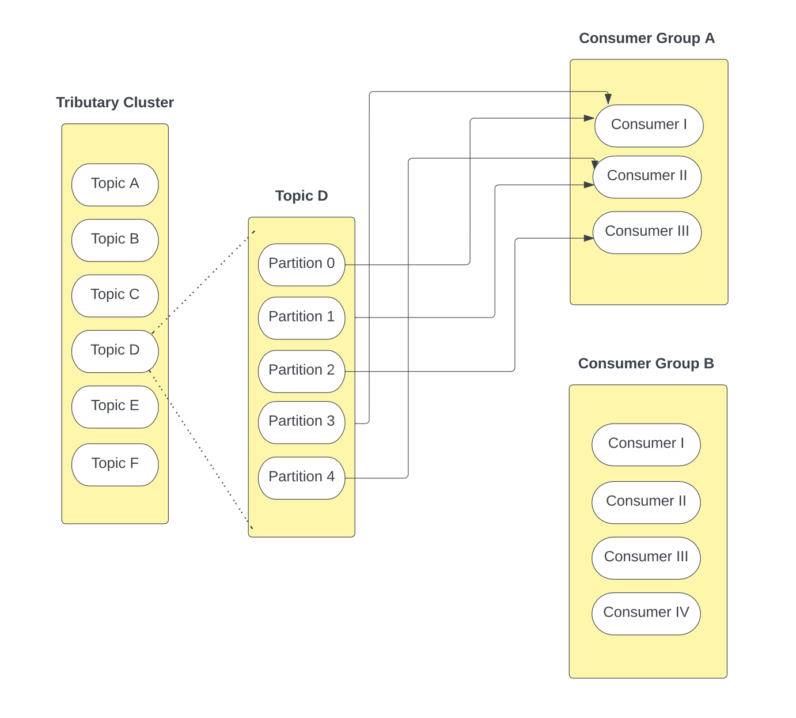
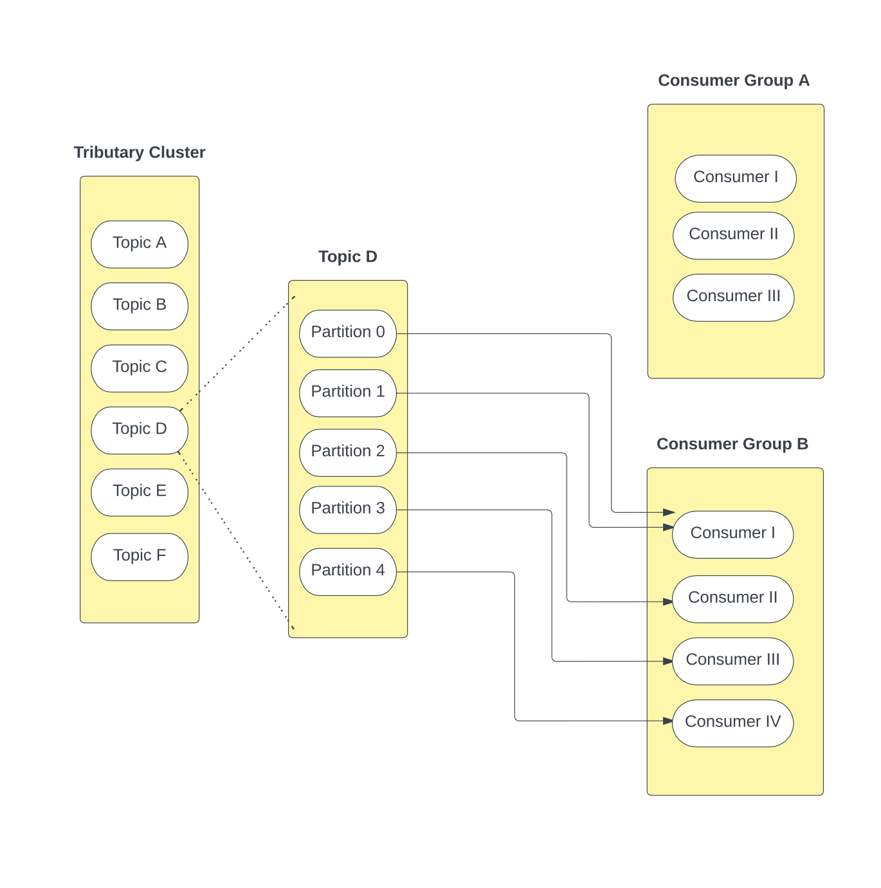
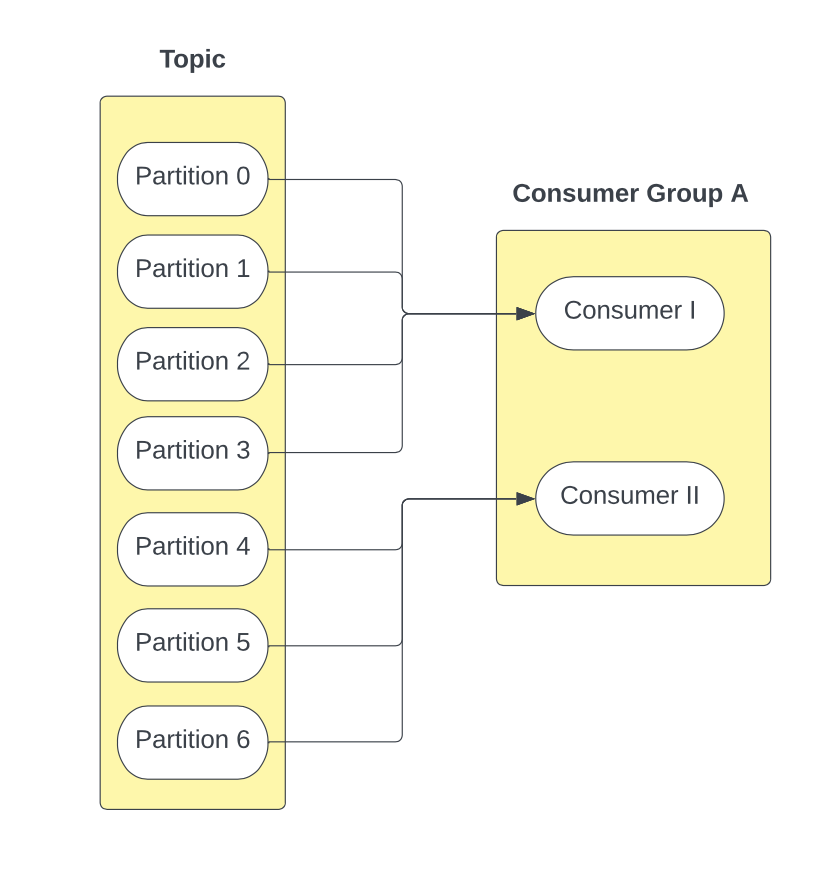
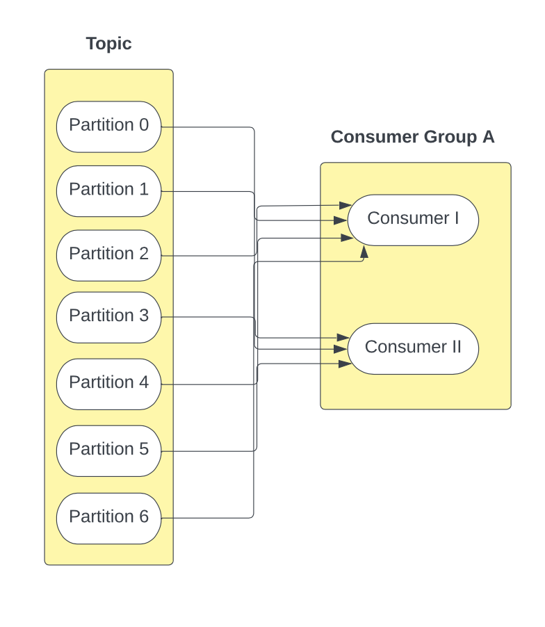

# 🌊 Just a simple Apache Kafka! <!-- omit in toc -->

Below is the specification of this project (or assignment 👀). However, we do have blogs which were written during the process of creating this project, you may want to check that out:
- [Initial Design](./developer_blogs/InitialDesign.md)
- [Final Design](./developer_blogs/FinalDesign.md)  

- [1. Overview](#1-overview)
- [2. Engineering Requirements](#2-engineering-requirements)
  - [2.1. Message Lifecycle: A Simple Example](#21-message-lifecycle-a-simple-example)
  - [2.2. Message Structure](#22-message-structure)
  - [2.3. Producers](#23-producers)
    - [2.3.1. Allocation of Messages to Partitions](#231-allocation-of-messages-to-partitions)
  - [2.4. Consumer and Consumer Groups](#24-consumer-and-consumer-groups)
    - [2.4.1. Consumers](#241-consumers)
    - [2.4.2. Consumer Groups](#242-consumer-groups)
    - [2.4.3. Consumer Rebalancing](#243-consumer-rebalancing)
      - [2.4.3.1. Range Rebalancing](#2431-range-rebalancing)
      - [2.4.3.2. Round Robin Rebalancing](#2432-round-robin-rebalancing)
  - [2.5. Replay Messages](#25-replay-messages)
  - [2.6. Design Considerations](#26-design-considerations)
- [3. Interface](#3-interface)
  - [3.1. Java API](#31-java-api)
  - [3.2. Philosophy and Usage](#32-philosophy-and-usage)
  - [3.3. Command Line Interface](#33-command-line-interface)

# 1. Overview

Event-Driven Architecture makes up much of the backbone of modern software. With a move towards decentralised microservice systems, there is a need for scalable asynchronous communication between software components.

In this assignment you will use principles discussed in lectures to **write a Java API** that another engineer could use to build an event-driven system.

This library is based on a heavily simplified version of the event streaming infrastructure [Apache Kafka](https://kafka.apache.org/), which you can read more about for your own interest. No understanding of Kafka is required to complete this assignment

# 2. Engineering Requirements

The fundamental premise on which Event-Driven Architecture rests is the ability of producer and consumer entities in the system to share data asynchronously via a stream-like channel.

However, our library will allow for more complex interactions than simply that of a single channel.

A **Tributary Cluster** contains a series of **topics**. A topic contains events which are logically grouped together. For example, a cluster could contain two topics: one for images-related events and one for video-related events. You can think of them like a table in a database or a folder in a file system.

Within each topic, there are a series of partitions - each partition is a queue where new messages are appended at the end of the partition.

A unit of data within a Tributary is a **message**, or record or event. For example, to update their profile a user may send a message to Partition 1 in Topic A, and this message will be appended to Partition 1 in Topic A. Each message has an optional key to indicate which partition it should be appended to.

A topic can be related to “user profiles” and each message relates to requesting an update to a specific profile. However, considering there can be many such requests at a given time, the system divides the incoming requests into multiple partitions. There can be multiple **consumers** consuming messages at the same time (concurrently). However, each partition is handled by only one consumer. Multiple consumers will allow us to effectively utilise the underlying hardware with multiple cores.

In the context of the library you are building, topics are parameterised on a generic type; all event payloads within that topic must be of the specified type.

## 2.1. Message Lifecycle: A Simple Example

Let us take the example of a user updating their profile. This results in an event being generated by the **producer** for a topic “user profiles” with the updated profile information. This event is now delivered to the Tributary, which assigns the event to one of the partitions. The producer indicates whether the message is randomly allocated to a partition, or provides a key specifying which partition to append the message to.

A consumer processes one or more partitions by sequentially processing (consuming) events in the allocated partitions.

## 2.2. Message Structure

Below is an example of a message structure that you could implement. You are free to add/remove fields as you see fit as long as the base requirements are still met.

- Headers
  - Datetime created;
  - ID;
  - Payload type;
- Key; and
- Value. The value is an object containing relevant information for a topic. Considering information required for different topics may change, you should consider using a generic type here.

## 2.3. Producers

A Producer is responsible for sending messages to the Tributary system. As shown in the diagram above, a message contains a header, an optional key, and value. Messages may have a key which indicates the specific partition
to send the message to. Alternatively, the partition the message should be sent to may be directly given to the producer by the system.

### 2.3.1. Allocation of Messages to Partitions

Producers can indicate whether to send a message to a particular partition by providing the corresponding partition key or requesting random allocation. There are two types of producers:

- **Random Producers** - the producer requests the Tributary system to randomly assign a message to a partition
- **Manual Producers** - the producer requests the Tributary system to assign a message to a particular partition by providing its corresponding key.

Once a producer has been created with one of the two above message allocation methods, it cannot change its message allocation method. Your implementation should allow for producers to be created with new message allocation methods added in the future.

## 2.4. Consumer and Consumer Groups

### 2.4.1. Consumers

Consumers are responsible for consuming (processing) messages stored in partition queues. A consumer consumes messages from a partition in the order that they were produced, and keeps track of the messages that have been consumed. Consumers operate as part of a consumer group. Each partition can be consumed by only one consumer per consumer group. Consumers can consume from more than one partition within a consumer group. 

### 2.4.2. Consumer Groups

A consumer group consists of one or more consumers, that are together capable of consuming from all the partitions in a topic.

Each topic can have multiple consumer groups. While each consumer group assigned to the same topic may contain a different number of consumers, they will all consume from the same number of partitions, i.e. all the partitions in a topic will always be handled by any consumer group assigned to the topic.

When a new consumer group is created, the consumers in the group begin their consumption from the **first unconsumed message** in all of the topics partitions they are assigned to. In other words, all consumers that share a partition consume messages parallel to each other, so that each message is only consumed once (except in controlled replays).

For example, in the image below Topic D is consumed by Consumer Group A, which has its 3 consumers assigned to the 5 partitions. Topic D is also consumed by Consumer Group B, which has its 4 consumers assigned to the 5 partitions.

### 2.4.3. Consumer Rebalancing

A system should be able to dynamically change the rebalancing strategy between one of two rebalancing strategies - range rebalancing, and round robin rebalancing. These rebalancing strategies are used to reassign partitions to consumers anytime a consumer is added to a consumer group or an existing consumer is removed from a consumer group.

If a partition is assigned a new consumer after rebalancing, the new consumer should continue consumption from where the previous consumer left off.

#### 2.4.3.1. Range Rebalancing

**Range** - The partitions are divided up evenly and allocated to the consumers. If there is an odd number of partitions, the first consumer takes one extra.

In the above example, Partitions 0, 1, 2, 3 are allocated to Consumer I and Partitions 4, 5 and 6 are allocated to Consumer II.

#### 2.4.3.2. Round Robin Rebalancing

**Round Robin** - In a round robin fashion, the partitions are allocated like cards being dealt out, where consumers take turns being allocated the next partition.

In the above example, Partitions 0, 2, 4 and 6 are allocated to Consumer I, and Partitions 1, 3 and 5 are allocated to Consumer II.

## 2.5. Replay Messages

One of the most powerful aspects of event streaming is the ability to **replay** messages that are stored in the queue. The way this can occur is via a **controlled replay**, which is done from a message offset in a partition. Messages from that point onwards are streamed through the pipeline, until the most recent message at the latest offset is reached.

> ℹ  NOTE: The above image demonstrates a consumer starting at offset 6 that performed normal consumption until offset 9. This consumer then triggered a
> controlled replay from offset 4 that played back all the messages from that offset until the most recently consumed message (i.e messages 6, 7, 8 and 9
> were consumed again).

## 2.6. Design Considerations

Two design considerations you will need to think about in your solution are as follows:

- **Concurrency** - since Producers and Consumers are all running in parallel, operating on a shared resource, how will you ensure correctness?
- **Generics** - How will you ensure that an object of any type can be used as an event payload in a tributary topic?

One of the key aims of this assignment is to get accustomed with concurrency in Java using the synchronized keyword as shown in lectures. As such
**we will not be permitting the use of any existing synchronization and concurrency libraries** as you must implement thread-safety yourselves.
This includes but is not limited to:

- The entire `java.util.concurrent` package
  - This includes any classes or interfaces that require this import namely thread-safe objects (eg `AtomicInteger`) or concurrency primitives (eg semaphores).
- Any other thread-safe classes such as `StringBuffer`

# 3. Interface

## 3.1. Java API

Since you are building a library on which other engineers can develop event-driven systems, you will need to have some classes which are available for others to use in their implementations - just as you do when you import any Java library.

You will need to determine which classes are part of the interface (API which other developers can use), and these classes will need to be documented with JavaDoc and go inside a folder called `api`. All other classes are considered part of the internal workings of the system (black box) and do not need JavaDoc. These classes should go inside a folder called `core`.

## 3.2. Philosophy and Usage

The way we refer to API here is a little bit different to how you might be used to it from previous courses. In something like COMP1531, the term “API” usually refers to a web-based service that you can call upon via an endpoint, to perform some of the work required by your application. In that scenario, components that make up the API are abstracted away from your application.

However, when we refer to an API here, we are describing more a library rather than a service. By using this library, we can construct various different domain specific applications by bringing together the components provided by the library. The Command Line Interface application described below is one specific instance of a domain-specific application that we are using our library to build, but it is not the behaviour of the API in itself. That is to say, the functionality that we want from the CLI isn’t abstracted behind the API as a service that facilitates requests based on user input, but rather we use the components provided by the library and coordinate them for this specific use case.

We should be able to take this library and create some other domain specific application that isn’t tied to this specific Command Line Interface program. Additionally, the components provided by your library like the producer and the consumer should be able to be extended by the user of your library to define new types of producers and consumers for their specific application, building upon the mechanisms and functionality provided by your library.

Although the library exposes a bunch of components publicly (the stuff that goes in `api` folder), there will also be things that the library uses internally that isn’t exposed to the user (the stuff that goes in the `core` folder). Hence the user only interacts with the public API of the library and uses the library and its components in the way the API defines.

You can think of all of this very similarly to the Java API. It is a library that provides a bunch of components that we can use to build our applications. The components that are available and the way we are able to use them are defined by the public API. We can also extend things provided by the library. For example, if I really wanted to, I could extend the `ArrayList` class, or maybe more practically, I can implement provided interfaces in my own custom components.

## 3.3. Command Line Interface

In order to run usability tests on your solution you will need to develop a way to interact with tributaries, producers, and consumers via a command line interface.

To do so, you should write a wrapper class called `TributaryCLI` that allows the user to input commands that create, modify, and interact with a tributary cluster system. This class should be in a separate package to the `api/core` packages of your library, as it shouldn't be a part of your library that other engineers developing their own event-driven systems would use.

As an **example** of what commands your CLI may provide, the following table has CRUD operations that you can implement - you can add/modify/remove CRUD operations as you see fit. If you choose to implement the table as is, note that you are free to modify the naming/syntax/output of commands. **The only requirement for the CLI is that you can use it to showcase an implementation of the [Engineering Requirements](#3-engineering-requirements) discussed in Section 3** - again, the table is only a guide.

<table>
  <tr>
    <th><b>Command</b></th>
    <th><b>Description</b></th>
    <th><b>Output</b></th>
  </tr>
  <tr>
    <td><code>create topic &lt;id&gt; &lt;type&gt;</code></td>
    <td>
      <ul>
        <li>Creates a new topic in the tributary.</li>
        <li><code>id</code> is the topic’s identifier.</li>
        <li>
          <code>type</code> is the type of event that goes through the topic.
          While this can be any type in Java, for the purposes of the CLI it can
          either be <code>Integer</code> or <code>String</code>.
        </li>
      </ul>
    </td>
    <td>
      A message showing the id, type and other relevant information about the
      topic confirming its creation.
    </td>
  </tr>
  <tr>
    <td><code>create partition &lt;topic&gt; &lt;id&gt;</code></td>
    <td>
      <ul>
        <li>
          Creates a new partition in the topic with id <code>topic</code>.
        </li>
        <li><code>id</code> is the partition’s identifier.</li>
      </ul>
    </td>
    <td>A message confirming the partition’s creation.</td>
  </tr>
  <tr>
    <td>
      <code>create consumer group &lt;id&gt; &lt;topic&gt; &lt;rebalancing&gt;</code>
    </td>
    <td>
      <ul>
        <li>Creates a new consumer group with the given identifier.</li>
        <li>
          <code>topic</code> is the topic the consumer group is subscribed to.
        </li>
        <li>
          <code>rebalancing</code> is the consumer group’s initial rebalancing
          method, one of <code>Range</code> or <code>RoundRobin</code>.
        </li>
      </ul>
    </td>
    <td>A message confirming the consumer group’s creation.</td>
  </tr>
  <tr>
    <td><code>create consumer &lt;group&gt; &lt;id&gt;</code></td>
    <td>
      <ul>
        <li>Creates a new consumer within a consumer group.</li>
      </ul>
    </td>
    <td>A message confirming the consumer’s creation.</td>
  </tr>
  <tr>
    <td><code>delete consumer &lt;consumer&gt;</code></td>
    <td>
      <ul>
        <li>Deletes the consumer with the given id.</li>
      </ul>
    </td>
    <td>
      A message confirming the consumer’s deletion, and an output of the
      rebalanced consumer group that the consumer was previously in.
    </td>
  </tr>
  <tr>
    <td>
      <code>create producer &lt;id&gt; &lt;type&gt; &lt;allocation&gt;</code>
    </td>
    <td>
      <ul>
        <li>Creates a new producer which produces events of the given type.</li>
        <li>
          <code>allocation</code> is either <code>Random</code> or
          <code>Manual</code>, determining which method of partition selection
          is used for publishing events.
        </li>
      </ul>
    </td>
    <td>A message confirming the producer’s creation.</td>
  </tr>
  <tr>
    <td>
      <code>produce event &lt;producer&gt; &lt;topic&gt; &lt;event&gt; &lt;partition&gt;</code>
    </td>
    <td>
      <ul>
        <li>
          Produces a new event from the given producer to the given topic.
        </li>
        <li>
          How you represent the event is up to you. We recommend using a JSON
          structure to represent the different parts of an event and the
          <code>event</code> parameter to this command is a filename to a JSON
          file with the event content inside.
        </li>
        <li>
          <code>partition</code> is an optional parameter used only if the
          producer publishes events to a manually specified partition which
          isn't stored inside the message structure
        </li>
      </ul>
    </td>
    <td>The event id, the id of the partition it is currently in.</td>
  </tr>
  <tr>
    <td><code>consume event &lt;consumer&gt; &lt;partition&gt;</code></td>
    <td>
      <ul>
        <li>
          The given consumer consumes an event from the given partition.
          Precondition: The consumer is already allocated to the given
          partition.
        </li>
      </ul>
    </td>
    <td>
      The id and contents of the event, showing that the consumer has received
      the event.
    </td>
  </tr>
  <tr>
    <td>
      <code>consume events &lt;consumer&gt; &lt;partition&gt; &lt;number of events&gt;</code>
    </td>
    <td>
      <ul>
        <li>Consumes multiple events from the given partition.</li>
      </ul>
    </td>
    <td>The id and contents of each event received in order.</td>
  </tr>
  <tr>
    <td><code>show topic &lt;topic&gt;</code></td>
    <td></td>
    <td>
      Prints a visual display of the given topic, including all partitions and
      all of the events currently in each partition.
    </td>
  </tr>
  <tr>
    <td><code>show consumer group &lt;group&gt;</code></td>
    <td></td>
    <td>
      Shows all consumers in the consumer group, and which partitions each
      consumer is receiving events from.
    </td>
  </tr>
  <tr>
    <td>
      <code>parallel produce (&lt;producer&gt;, &lt;topic&gt;, &lt;event&gt;), ...</code>
    </td>
    <td>
      <ul>
        <li>
          Produces a series of events in parallel. This is purely for
          demonstrating that your tributary can cope with multiple producers
          publishing events simultaneously.
        </li>
      </ul>
    </td>
    <td>For each event, the id of the partition it is currently in.</td>
  </tr>
  <tr>
    <td>
      <code> parallel consume (&lt;consumer&gt;, &lt;partition&gt;) </code>
    </td>
    <td>
      <ul>
        <li>
          Consumes a series of events in parallel. This is purely for
          demonstrating that your tributary can cope with multiple consumers
          receiving events simultaneously.
        </li>
      </ul>
    </td>
    <td>For each event consumed, the contents of the event and its id.</td>
  </tr>
  <tr>
    <td>
      <code>set consumer group rebalancing &lt;group&gt; &lt;rebalancing&gt;</code>
    </td>
    <td>
      <ul>
        <li>
          Updates the rebalancing method of consumer group <code>group</code> to
          be one of <code>Range</code> or <code>RoundRobin</code>.
        </li>
      </ul>
    </td>
    <td>A message confirming the new rebalancing method.</td>
  </tr>
  <tr>
    <td>
      <code>playback &lt;consumer&gt; &lt;partition&gt; &lt;offset&gt;</code>
    </td>
    <td>
      <ul>
        <li>Plays back events for a given consumer from the offset.</li>
      </ul>
    </td>
    <td>The id and contents of each event received in order.</td>
  </tr>
</table>